## electron 概述

### electron是什么

可以通过前端技术实现桌面安装应用。 主要由Chromium + nodejs组成。 一下是electron架构图

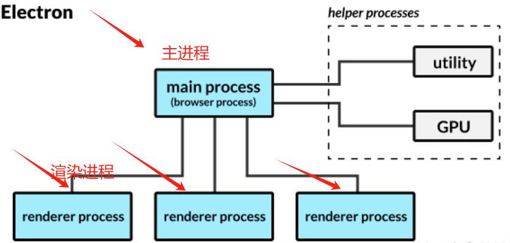

##  搭建electron 项目

```
# 快速开始 git clone
  1  npm install -g electron / cnpm install -g electron
   
# 2 electron-forge 相当于 electron 的一个脚手架，可以让我们更方便的创建、运行、打包electron 项目。   
   npx create-electron-app my-new-app  ||  yarn create-electron-app my-new-app
   cd my-new-app
   npm start
  
# 3手动搭建一个 electron 项目
    1、新建一个项目目录 例如：electrondemo01
    2、在 electrondemo01 目录下面新建三个文件: index.html、main.js 、package.json
    3、index.html 里面用 css 进行布局（以前怎么写现在还是怎么写）
    4、在 main.js 中写如下代码：
    
    const { app, BrowserWindow } = require("electron")
    const path = require("path")
    const createWindow=()=>{
    const mainWindow = new BrowserWindow({
    width: 800, height: 600, });
    mainWindow.loadFile(path.join(__dirname, 'index.html'));
    // mainWindow.loadURL('https://github.com');
    }
    //监听 electron ready 事件创建窗口
    app.on('ready', createWindow);
    //监听窗口关闭的事件，关闭的时候退出应用，macOs 需要排除
    app.on('window-all-closed', () => {
    if (process.platform !== 'darwin') {
    app.quit();
    }
    });
    //Macos 中点击 dock 中的应用图标的时候重新创建窗口
    app.on('activate', () => {
    if (BrowserWindow.getAllWindows().length === 0) {
    createWindow();
    }
    });
    
    ##有坑  安装依赖 cnpm install electron --save-dev
     yarn start 报错 
     
    throw new Error('Electron failed to install correctly, please delete node_modules/electron and try     installing again')
    
    #解决方案  
    cnpm remove electron 
    cnpm update electron --save-dev   #通过update的方式安装就可以正常启动项目
```


## vue3+vite+electron 搭建项目 打包大坑 重点

```
1. 先创建vue项目  # npm create vue
#  参考网址  <https://blog.csdn.net/qq_19991931/article/details/130429607>
```

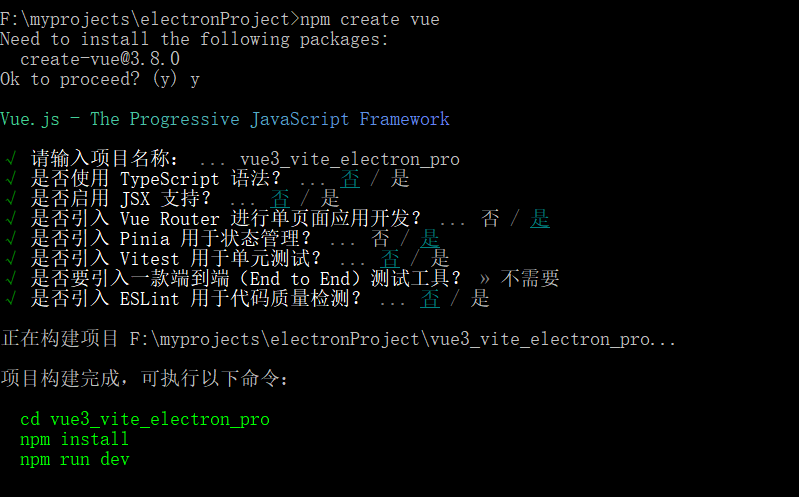

```
2. 安装  yarn add -D electron electron-builder  
#网速不好会报错误 connect ETIMEDOUT 20.205.243.166:443  下载依赖的地址超时 可以用手机热点试试
```

```
3.创建 main.js  修改packge.json

```

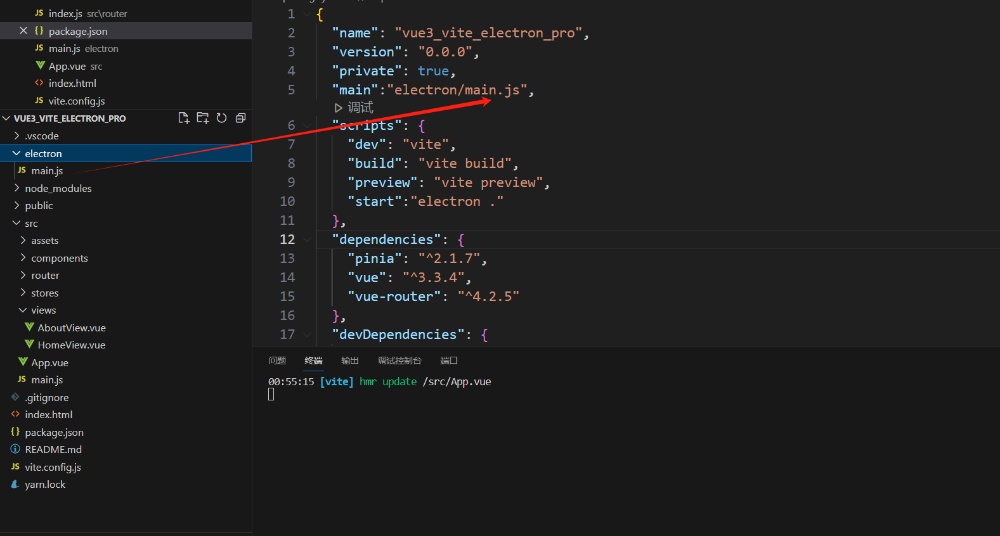

```
4. 配置完成以后分别启动yarn dev 和 yarn start，出现以下窗口表示搭建成功了。

```

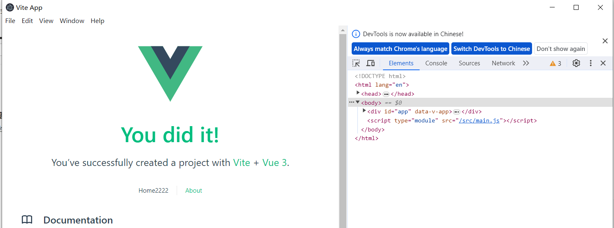

```
5 .优化 😆 😁 😉
因为现在需要启动两个服务，比较麻烦，可以借助concurrently插件整合。
一个命令完成多个应用的启动。同时安装cross-env插件设置我们的环境变量。
wait-on进行一个端口启动监听。
```

```
"scripts": {
    "dev": "vite",
    "build": "vite build",
    "preview": "vite preview",
    "start": "electron ."
  },
  ### 修改成
  "scripts": {
    "dev": "concurrently -k \"vite\" \"yarn dev:electron\"",
    "dev:electron": "wait-on tcp:5173 && cross-env NODE_ENV=development electron .",
    "build": "vite build && electron-builder --win --config",
    "build:mac": "vite build && electron-builder --mac --config",
    "build:linux": "vite build && electron-builder --linux --config"
  },
```

```
6 yarn build  打包时候下载包资源 gitHub请求超时
 ## https://registry.npmmirror.com/binary.html?path=electron/   需要什么下载什么
 
Get "https://github.com/electron/electron/releases/download/v27.0.4/electron-v27.0.4-win32-x64.zip": dial tcp 20.205.243.166:443: connectex: A connection attempt failed because the connected party did not properly respond after a period of time, or established connection failed because connected host has failed to respond.
```


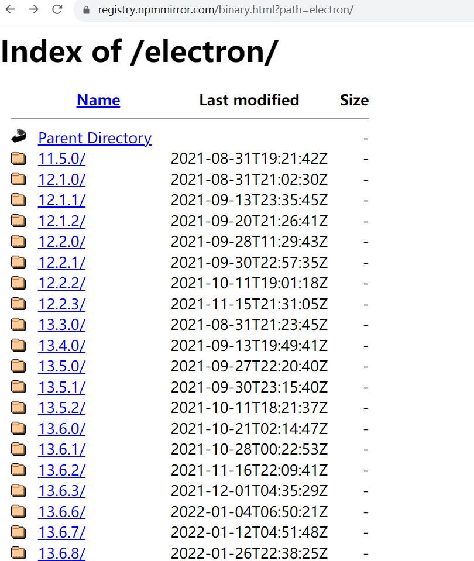


```
### 7  SHASUMS256.txt      验证文件
      electron-v27.0.4-win32-x64.zip 
      electron-v27.0.4-win32-x64  这个三个都需要
```

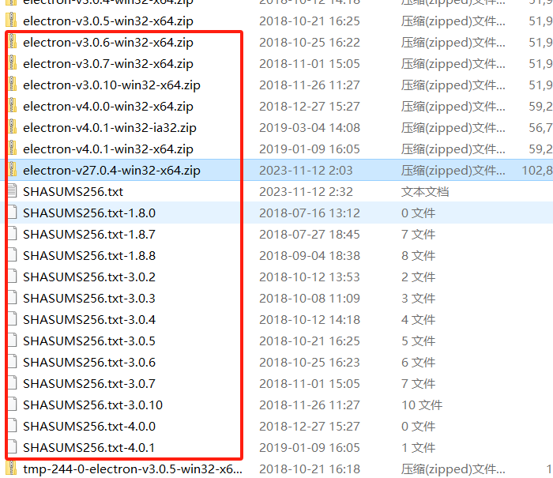


​		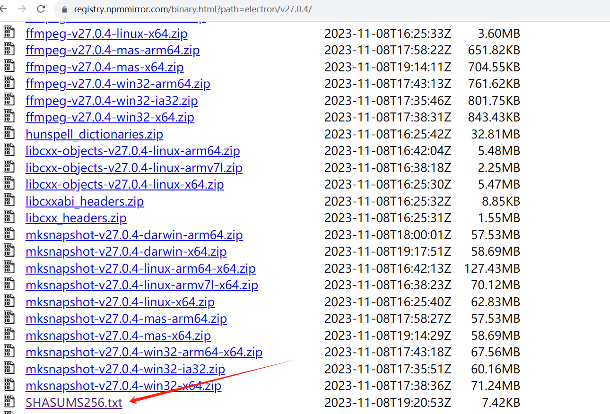

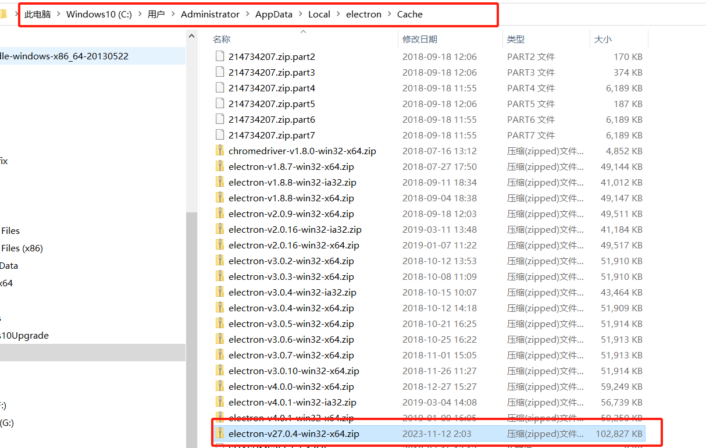


```
## 8 针对 winCodeSign-2.6.0 下载失败
X Get "https://github.com/electron-userland/electron-builder-binaries/releases/download/winCodeSign-2.6.0/  -2.6.0.7z":

手动下载这个包   创建 winCodeSign目录 把文件丢进去  C:\Users\Administrator\AppData\Local\electron\Cache\winCodeSign

```

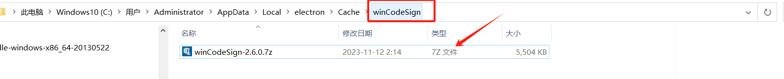


```
## 9 针对 nsis-3.0.4.1 下载失败，大部分是网络原因，先行在github下载也一样龟速，但起码看得见速度，也不会满屏报错。打开地址： https://github.com/electron-userland/electron-builder-binaries/releases 寻找你所需要的版本。

下载完成后，打开此zip包，但不是所有文件都需要。我们需要其中两个文件：nsis 和 nsis-resources

```

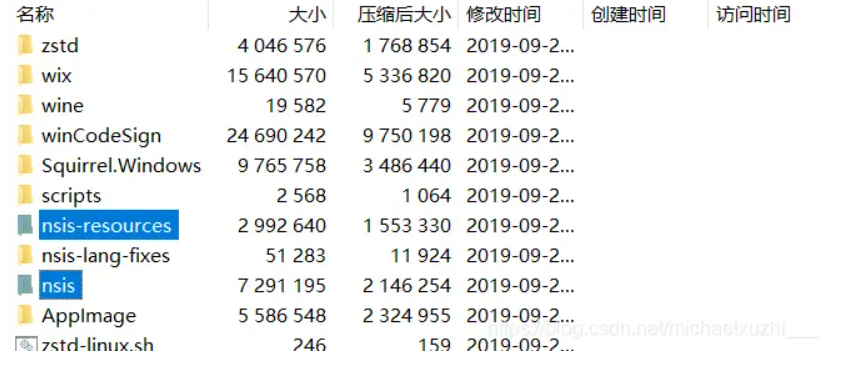


```
## 10  将这两个文件夹提取出来。重命名：其中 （nsis -> nsis-3.0.4.1 ） （nsis-resources -> nsis-resources-3.4.1）

然后 C:\Users\Administrator\AppData\Local\electron-builder\Cache 进入到此目录下，新建一个文件夹，名为： nsis ，再把刚刚解压出来的两个文件夹放到这个文件夹中。

作者：VinSmokeW
链接：https://www.jianshu.com/p/35abb68d0331
来源：简书
著作权归作者所有。商业转载请联系作者获得授权，非商业转载请注明出处。

```


## 完整打包配置

```
## 参考 https://blog.csdn.net/weixin_33936401/article/details/88722952

"build": {
    "productName":"xxxx",//项目名 这也是生成的exe文件的前缀名
    "appId": "com.leon.xxxxx",//包名  
    "copyright":"xxxx",//版权  信息
    "directories": { // 输出文件夹
      "output": "build"
    }, 
    "nsis": {
      "oneClick": false, // 是否一键安装
      "allowElevation": true, // 允许请求提升。 如果为false，则用户必须使用提升的权限重新启动安装程序。
      "allowToChangeInstallationDirectory": true, // 允许修改安装目录
      "installerIcon": "./build/icons/aaa.ico",// 安装图标
      "uninstallerIcon": "./build/icons/bbb.ico",//卸载图标
      "installerHeaderIcon": "./build/icons/aaa.ico", // 安装时头部图标
      "createDesktopShortcut": true, // 创建桌面图标
      "createStartMenuShortcut": true,// 创建开始菜单图标
      "shortcutName": "xxxx", // 图标名称
      "include": "build/script/installer.nsh", // 包含的自定义nsis脚本
    },
    "publish": [
      {
        "provider": "generic", // 服务器提供商 也可以是GitHub等等
        "url": "http://xxxxx/" // 服务器地址
      }
    ],
    "files": [
      "dist/electron/**/*"
    ],
    "dmg": {
      "contents": [
        {
          "x": 410,
          "y": 150,
          "type": "link",
          "path": "/Applications"
        },
        {
          "x": 130,
          "y": 150,
          "type": "file"
        }
      ]
    },
    "mac": {
      "icon": "build/icons/icon.icns"
    },
    "win": {
      "icon": "build/icons/aims.ico",
      "target": [
        {
          "target": "nsis",
          "arch": [
            "ia32"
          ]
        }
      ]
    },
    "linux": {
      "icon": "build/icons"
    }
  }
```


## 最后打包成功

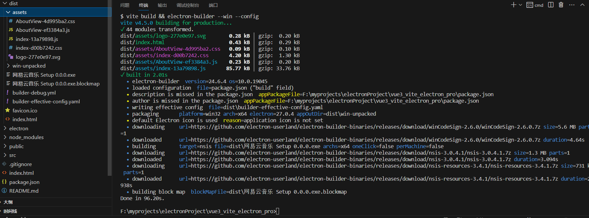


## electron 主进程 和渲染进程的关系

```
一个electron应用 通过 packge.json 中的 main  入口文件（也是主进程文件） 
创建了一个应用实例，（new  BrowserWindow）,

mainWindow.loadFile(path.join(__dirname, 'index.html'));   加载render process 

一个应用只有一个主进程， 一个进程可以有多个线程。

进程是计算机分配资源的基础单位
```

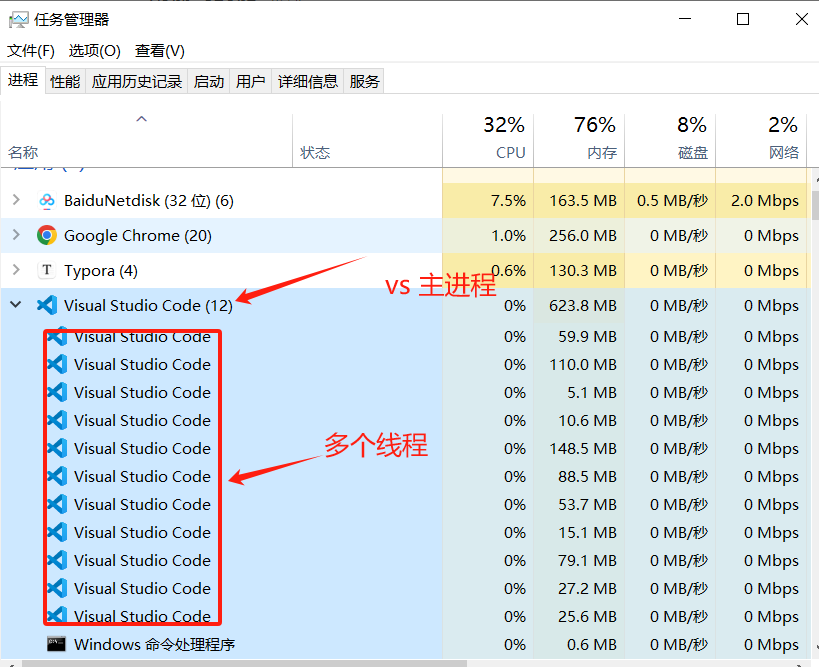


## electron中内置的主进程模块 和 渲染进程模块

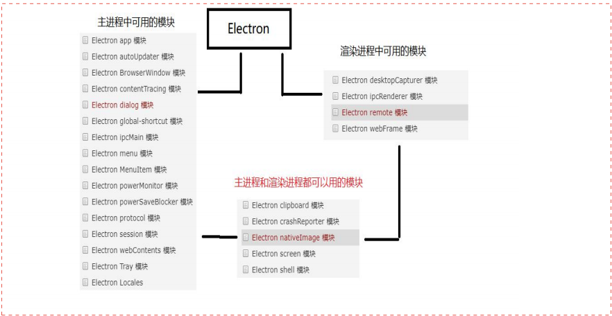

**具体模块的 事件， 参考官网docs**

** <https://www.electronjs.org/zh/docs/latest/api/app#%E4%BA%8B%E4%BB%B6-web-contents-created>**

## 渲染进程和渲染经常直接的通讯方式

1. 可以使用localStroage

2. pinal vuex  数据管理插件

   

### 

