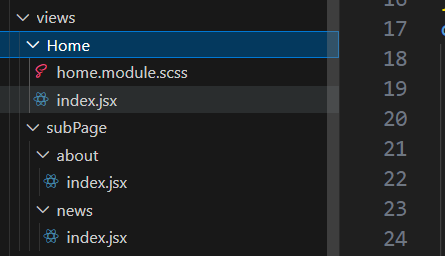
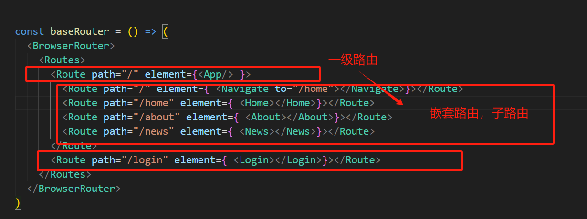

## 老项目的写法

1. 目录结构

   

```
第一步 新建router/index.js 配置baseRouter

import Home from "@/views/Home"
import About from "@/views/subPage/About"
import News from "@/views/subPage/News"
import { BrowserRouter,Route,Routes, Navigate } from "react-router-dom"


const baseRouter = () => (
  <BrowserRouter>
    <Routes>
      <Route path="/" element={<App/> }>
      
      	//组件式路由 redirect 重定向	
      	<Route path="/" element={ <Navigate to="/home"></Navigate>}></Route> 
      	
        <Route path="/home" element={ <Home></Home>}></Route>
        <Route path="/about" element={ <About></About>}></Route>
        <Route path="/news" element={ <News></News>}></Route>
      </Route>
    </Routes>
  </BrowserRouter>
)
第二部  main.jsx 中引入Router
import Router from "@/router"
console.log(Router);
ReactDOM.createRoot(document.getElementById('root'),{identifierPrefix:"react-"}).render(
  <Provider store={ store }>
      <React.StrictMode>
         <Router></Router>      
      </React.StrictMode>
    
  </Provider>
  
)

第三步  App.jsx 中 使用 <Outlet/>   相当于vue 的  router-view 占位符，显示对应路由组件
function App() {
  return (
      <div className='content bg'>
         App 页面
         
        <Link to="/home"> home</Link>   //Link 组件跳转
        &nbsp;
        <Link to="/about">about</Link>
  
        <Outlet/>

      </div>
       
  )
}

export default App
```



## react 18 新的router 写法

```
1.router/index.js

import { Navigate } from "react-router-dom"
import Home from "@/views/Home"
import Login from "@/views/Login"
import About from "@/views/subPage/About"
import News from "@/views/subPage/News"

const routes = [
  {
    path:"/",
    element:<Navigate to="/home"></Navigate>   //重定向
  },
  {
    path:"/Home",
    element:<Home/>,
    children:[
      {
        path:"about",
        element:<About/>,
      },
      {
        path:"news",
        element:<News/>,
      }
    ]
  },
  {
    path:"/login",
    element:<Login/>,
  }
]
export default routes;

2.main.js 中

import store from './store'
import { Provider } from 'react-redux'

import App from './App'
import { BrowserRouter } from 'react-router-dom'  //引入history路由 

ReactDOM.createRoot(document.getElementById('root'),{identifierPrefix:"react-"}).render(
  <Provider store={ store }>
    <BrowserRouter>
    <React.StrictMode>
         <App></App>
      </React.StrictMode>
    </BrowserRouter>
  </Provider>
  
)

3.App.jsx 中使用 

import routes from "@/router"   //引入路由表
import { useRoutes ,Link} from "react-router-dom"
function App() {
  let outlet =useRoutes(routes)   //注册
  return (
      <div className='content bg'>
        {outlet}       //占位符 
      </div>
       
  )
}

export default App

4. /home/about 嵌套子路由 在  Home/index.js 中
import { Outlet } from "react-router-dom"

function Home() {
  return ( 
    <>
      home 页面
      <Outlet/>    //占位符
    </>
         
  )
}

export default Home

```

### 路由懒加载写法

```
 import React, { lazy } from 'react'
 import { Navigate } from 'react-router-dom';

import Home from "@/views/Home"
const Login = lazy(() => import('@/views/Login'))
const About = lazy(() => import('@/views/subPage/about'))
const News = lazy(() => import('@/views/subPage/news'))

//fallback={<div>loading......</div>}     
//懒加载时间比较久旧显示loding, 可以自己封装一个漂亮的loding组件放在这里

const loadingComponent = (comPonent) => (
  <React.Suspense fallback={<div>loading......</div>}>
    {comPonent}
  </React.Suspense>
)
const routes = [
  {
    path:"/",
    element:<Navigate to="/home"></Navigate>
  },
  {
    path:"/Home",
    element:<Home/>,
    children:[
      {
        path:"about",
        element:loadingComponent(<About/>),
      },
      {
        path:"news",
        element:loadingComponent(<News/>),
      }
    ]
  },
  {
    path:"/login",
    element:loadingComponent(<Login/>),
  }
]
export default routes;
```

