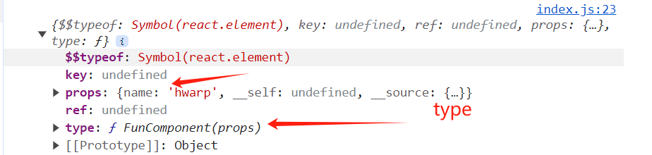

## 1 什么是React

+ react是一个用于构建用户界面的JacaScript库，核心是专注视图，目的是为了实现组件化的开发。

## 2 创建项目

```
npx create-react-app my_react-project

cd my_react_project

yarn start
```


## 3.1 JSX 渲染

+ 是一种js和HTML 混合的语法，将组件的结构、数据、样式都聚合在一起。

## 3.2 什么是元素

+ JSX 只是一种语法糖，通过bablejs **转译** 成 React.createElement 语法
+ React.createElement 会返回一个React 元素  （也叫虚拟dom , Vue中 是createVnode() ）
+ React 元素事实上就是一个普通的JS对象，用来描述这个组件的结构   ( abstract tree  类似Vue中把模板抽象成一颗 js 抽象语法树，主要就是来形容组件的结构，然后通过抽线语法树，生成 vnode 对象)
+ ReactDOM 来确保浏览器中真实的DOM数据和React 元素保持一致


  JSX

```
## jsx在线编译网站 https://www.babeljs.cn/repl

let element1=<h1 className='title' style={{color:'red'}}>hello react <span>我是第二个孩子span</span></h1>;
```

编译后的结果

```
React.createElement("h1", {
  className: "title",
  style: {
    color: 'red'
  }
},
"hello react",  //第一个孩子是 文本节点 
                //第二个孩子是元素 所以又需要调用  React.createElement
 React.createElement("span", null, "\u6211\u662F\u7B2C\u4E8C\u4E2A\u5B69\u5B50span")
);
```

###  react 元素长什么样子 (react.element  就是虚拟dom)

### 深入React.createElement 源码

```
从上面的编译结果就知道 createElement  有3个参数
React.createElement("h1", {
  className: "title",     #type
  style: {				  # config	
    color: 'red'
  }
}, 
"hello react",  //第一个孩子是 文本节点  #children
                //第二个孩子是元素 所以又需要调用  React.createElement
 React.createElement("span", null, "world")
);
## 浏览器执行打印后返回一下格式的js对象  这就是React 虚拟dom
console.log(React.createElement("h1",{
  className:"title",
  color:"red"
},"hello",React.createElement('span',null,"world")));
```


```
##  深入源码
/**
 * @param: type 元素类型, 
 * config 元素的key,ref,style,className等
 * children 元素的子元素
 */
function createElement (type,config,children){
 let key , ref;
 if(config){
    key = config.key;       //根据上面的打印，可以看出来 ref ,key  是放在外层的，没用放在props 中
    ref = config.ref;
    delete config.ref;
    delete config.key;
 }
 let props = {...config};
 //如果参数的长度大于3，说明有多个儿子
 if(arguments.length > 3){
 	//截取掉类型，config后，循环判断儿子的类型
    props.children = Array.prototype.slice.call(arguments,2).map(wrapToVdom)
 }else if(arguments.length === 3){
  // 如果刚好传入3个参数，就判断一下还是是普通值，还是元素
  //wrapToVdom 这个函数主要是为了后续 diff对比优化
  props.children = wrapToVdom(children)
 }
 return {
  $$typeof:REACT_ELEMENT,
   type,
   key,
   ref,
   props
 }
}

/**
 * 判断传入的是普通值还是元素
 * @param  element 
 */

export function wrapToVdom(element) {
  return typeof element === "string" ||
    typeof element === "number"
    ? { type: REACT_TEXT, props: { content: element } } : element
}


 下面这张图是react官方的库 所打印的结果。 和我们自己实现的一样。
```


```
 	react 18.0 版本不支持 ReactDOM.render() 了
 
 // ReactDOM.render(<h1>hello react</h1>,document.getElementById("root"))  不支持
	//创建一个根元素
    const root = ReactDOM.createRoot(document.getElementById("root"))
    //通过根源素渲染
    root.render(<h1>hello react</h1>)
 
```


## 3.3 render 源码解析

```
通过React.createElment() 得到了vdom 接下来旧要进行渲染, 将vdom转为真实dom 渲染在浏览器页面上
/*
 @param: vdom  container 容器 
*/
function render(vdom, container) {
  //把虚拟dom 变成真实 dom
  let newDom = createDom(vdom)
  //把真实dom 追加到父 节点 上
  if (newDom) {
    container.appendChild(newDom)
  }
}

/**
 * 
 * @param  vdom  
 * @return 真实dom
 */
function createDom(vdom) {
  let { type, props } = vdom;
  let dom;
  if (type === REACT_TEXT) {  //创建文本节点
    dom = document.createTextNode(props.content)
  } else if (typeof type === "string") { // type 是 h1,div,span 这些都是字符串就创建元素
    dom = document.createElement(type)
  }
  if (props) {
    //如果createElment 时候传入了config 就说明有属性需要处理
    //updateProps(dom,{},newProps)
    updateProps(dom, {}, props)    //初渲染 oldProps 肯定没有,直接传空对象
    
    let children = props.children;
    //wrapVdom(element) 函数中普通值是没用类型的，所以有type 属性的就可以认为是元素
    if(typeof children === "object" && children.type){
      //把节点挂载dom上
      mount(children,dom)
    }else if(Array.isArray(children)){ //如果children 是数组
      reconcileChildren(children,dom)
    }
  }
  //虚拟dom上挂载一个真实dom，经行映射，diff比较后差异后，找到自己对应的真实dom进行更新
  vdom.dom=dom;
  return dom;
}

/**
 * @param  dom  真实dom
 * @param  oldProps  旧的props
 * @param  newProps  新的props
 * 循环遍历config 中的属性，进行响应处理
 */
function updateProps(dom, oldProps, newProps) {
  for (let key in newProps) {
    if (key === 'children') { //此处不处理子节点
      continue;
    } else if (key === 'style') {  //处理style 属性，给真实dom 添加对应样式
      let styleObj = newProps[key]; 
      for (let attr in styleObj) {
        dom.style[attr] = styleObj[attr];
      }
    } else if (/^on[A-Z].*/.test(key)) {   //以on开头 如onClick 等事件处理，需要给dom添加对应的addEvent事件 

    } else {
      dom[key] = newProps[key]
    }
  }
  //循环旧的props ，如果新的props对象中没用这个属性，dom的这个属性旧要删除
  for(let key in oldProps){ 
    if(!newProps.hasOwnProperty(key)){
      dom[key]=null;
    }
  }
}

/**
 * @param  children  子节点数组
 * @parentDOM
 * //循环数组，调用挂载函数，挂载函数中又调用了createDom
 */
function reconcileChildren(children,parentDOM){
  children.forEach(element => {
    mount(element,parentDOM)
  });
}

启动项目，查看，自己的写的react,react-dom 模块。
从 React.createElement() -> ReactDOM.render()  #6啊 老哥，接着努力 
```


## 4 组件

+ 将页面分割成一个个独立、可服用的组件， 这样专注于组件的开发就是组件化开发思想
+ React 中的函数组件类似JavaScript 中的函数， 可以接受任意的入参（props）, 返回描述组件结构的 虚拟dom

## 4.1 函数（组件）的定义

+ 函数组件必须接收一个单一的props 对象，并 返回 react.element 元素
+ 组件名首字母必须大写， React中以首字母大写来区分，是原生的 div ,span,h1等原生标签，还是函数组件
+ 组件必须先定义，在使用
+ 组件的返回值，必须只有一个根元素

## 4.3 深入函数组件实现源码

```
//定义了一个函数组件 调用的时候需要传递一个name属性 ,return 的是vdom
function FunComponent(props){
  return <div className="title" style={{color:"red"}}>hello {props.name}</div>
}
//调用组件 传递了一个name 字段 hwarp
let element =<FunComponent name="hwarp"></FunComponent>

ReactDOM.render(element,document.getElementById("root"))

下图 就是 打印的vdom 是FunComponent 函数组件本身的vdom   return 的也是一个vdom
```




```
ReactDOM.render(vdom, container) 函数会 调用创建真实createDom(vdom) 函数

function createDom(vdom) {
  let { type, props } = vdom;
  console.log(type);
  let dom;
  if (type === REACT_TEXT) {  //创建文本节点
    dom = document.createTextNode(props.content)
  } else if(typeof type ==="function"){
      return mountFunctionComponent(vdom)  //处理函数组件
  }else if (typeof type === "string") { // type 是 h1,div,span 这些都是字符串就创建元素
    dom = document.createElement(type)
  }
  if (props) {
    //如果createElment 时候传入了config 就说明有属性需要处理
    //updateProps(dom,{},newProps)
    updateProps(dom, {}, props)
    
    let children = props.children;

    if(typeof children === "object" && children.type){
      mount(children,dom)
    }else if(Array.isArray(children)){ //如果children 是数组
      reconcileChildren(children,dom)
    }
  }
  //虚拟dom上挂载一个真实dom，经行映射，diff比较后差异后，找到自己对应的真实dom进行更新
  vdom.dom=dom;
  return dom;
}


/**
 * 处理函数组件
 * @param vdom 
 */
function mountFunctionComponent(vdom){
  let {type : functionComponent,props} =vdom;
  //执行函数组件, 创建返回的 vdom   
  //就是return <div className="title" style={{color:"red"}}>
  //				hello {props.name}</div>  这行代码
  
  let renderDom = functionComponent(props);
  console.log(renderDom);
  
  if(!renderDom) return null;
  return createDom(renderDom)    //有了vdom  接着递归掉用createDom, 根据
}

下图是打印的renderDOM,  比如函数组件1，返回函数组件2, 函数组件2中才用 <div>...</>
那么执行顺序是 ReactDOM.render() --> createDom() --> mountFunctionComponent()--->
			发现函数组件1中返回的又是一个函数组件 createDom() ---> mountFunctionComponent() 
			这次发现 返回的type 是 div 是一个string   就创建真实节点了。  这就形成了递归调用。
```


## 4.4 类组件源码实现

```
定义 一个类组件
class Login extends React.Component{
  render(){
  // 返回可以是一个vdom , 也可以是一个函数组件， 或者类组件
    return  <div className="title" style={{color:"red"}}>hello {this.props.name}</div>
  }
}

let element =<Login name="hwarp22"></Login>

console.log(element);
ReactDOM.render(element,document.getElementById("root"))

# 下图是打印的 class组件的 vdom  仔细观察
```


```
## 深入源码实现过程
//react 中所有的class组件 都要 extends React.Component 这个类

    class Component{   //Component 基类的简单定义
      //用来区分是函数组件还是类组件, 因为bable 编译后都是function
      static isClassComponent =true;
      constructor(props){
        this.props=props;
      }
      ....
    }
	
let element = <Login name="hwarp22"></Login>	 //Login 这个类组件的 vdom
ReactDOM.render(element,document.getElementById("root"))

ReactDOM.render() 调用 createDom(vdom) 进行进一步的处理
/**
 * @param vdom  虚拟dom
 * @return 真实dom
 */
function createDom(vdom) {
  let { type, props } = vdom;
  let dom;
  if (type === REACT_TEXT) {  //创建文本节点
    dom = document.createTextNode(props.content)
  } else if (typeof type === "function") {
  //--------------------------------------------------------------------------------------------
    //React.Component 这个基类上定义的标识。 区分类组件和函数组件
    if (type.isClassComponent) {
      return mountClassComponent(vdom)
    } else {
      return mountFunctionComponent(vdom) //函数组件
    }
  //-------------------------------------------------------------------------------------------  
  } else if (typeof type === "string") { // type 是 h1,div,span 这些都是字符串就创建元素
    dom = document.createElement(type)
  }
  if (props) {
    //如果createElment 时候传入了config 就说明有属性需要处理
    //updateProps(dom,{},newProps)
    updateProps(dom, {}, props)

    let children = props.children;

    if (typeof children === "object" && children.type) {
      mount(children, dom)
    } else if (Array.isArray(children)) { //如果children 是数组
      reconcileChildren(children, dom)
    }
  }
  //虚拟dom上挂载一个真实dom，经行映射，diff比较后差异后，找到自己对应的真实dom进行更新
  vdom.dom = dom;
  return dom;
}

/** 类组件的处理函数
 * @param vdom
 */
function mountClassComponent(vdom) {
  console.log(vdom);
  let { type: ClassComponent, props } = vdom;
  //创建组件的实例
  let classInstance = new ClassComponent(props);
  //获取组件返回的 vdom
  let renderVdom = classInstance.render();
   console.log(renderVdom);
  if (!renderVdom) return null;  //防止死循环

  return createDom(renderVdom)
}

if (!renderVdom) return null; ## 关于这句判断可以看下以下代码 死循环了

function FunComponent(props){
  return <Login></Login>
}

class Login extends React.Component{
  render(){
    return  <FunComponent></FunComponent>
}
**总结 不管类组件也好，还是函数组件也好， 他们return 
调用其他组件的层级有多深，最终都要返回一层能创建真实dom的 vdom **
打印最终需要创建的vdom   console.log(renderVdom);
```


## 3.9 react 组件的渲染过程

1. 执行yarn buildd 打包，或者yarn start 命令的时候。通过webpack中的打包插件经行编译。
2. webpack 编译之前先 进行jsx 转译成 js 语法， 把自己写的jsx 组件， 转化为一个个的 React.createElement 函数
3. 打包完成后，在public/index.html 中肯定通过 <script> </script> 标签 引入了打包后的js 文件。动态组件异步加载js,也是同理。只要通过浏览器加载js，就会经过浏览器的js处理内核进行执行js代码。
4. 项目跑起来，js在浏览器中执行，通过console 就能查看到对应的react.elment 元素。
5. 至于root.render(element1) ,生成真正的dom元素，在挂载到一个 id=root的元素上。通过浏览器的渲染内核就行渲染。

