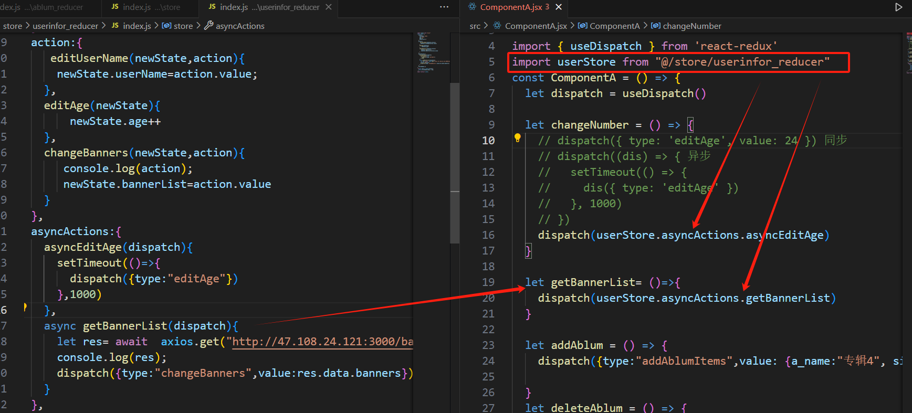

1.redux

### 什么是redux，什么时候使用redux

+ redux是一个js库，用于管理全局state状态。
+ 适用于有大量的state状态需要个很多组件中使用，跟新，需要追踪其变化。以及保证数据的统一正确，这就需要redux。
+ 相反如果需要管理的state很少，就没必要使用redux, 使简单的时间复杂化了。

## 2 redux 的组成

state 

   - DomainState 请求接口返回的数据
   - ui state    管理ui 状态的state
   - app State  全局的state

Action 事件对象

+ 必须包含type 属性， 一般使用大写常量定义
+ 只是描述要处理的事件类型，并不负责如何处理state更新

Reducer

+ 本质就是一个纯函数
+ 响应对应 action事件
+ 接收2个参数  state , action
+ 必须返回新的state

Store

+ 连接action 和 reducer
+ createStore 创建store
+ dispatch 发生action 
+ subscribe 注册监听

### redux 基本使用步骤

```react
1. 新建 action/index.js
/*
@param type  根据传入的type 返回对应的 action 对象
*/
export const createAction =(type) =>{
  return {
    type,
  }
}

2.新建 reducer/index.js

# 引入对应的action type

import { ADD_ITEMS } from "../constans/actionTypes“

//初始的state
let initState = {
  count:1
}
//根据对应的action 做对应的处理，  把reduer暴露出去
const reducer = (state=initState,action) =>{
  console.log(action);
   switch (action.type) {
    case ADD_ITEMS:
      return {...state}
   
    default:
      return state
   }
}

export default reducer;

3. 新建store/index.js

import { createStore} from "redux"

import reducer from "../reducer";
//根据传入的reducer 创建store
const store =createStore(reducer)
//暴露store
export default store;

4. 页面中使用 

import { createAction } from "./actions"  //引入创建action 的函数

import { ADD_ITEMS } from "./constans/actionTypes";  //引入action type常量

import store from "./store";


function App() {
  // State: counter 值
  
let [count,setCount] =useState(store.getState().count)   //页面渲染初始化count
  // Action: 当事件发生后，触发状态更新的代码
  const handleClick = () => {
    store.dispatch(createAction(ADD_ITEMS),store.getState().count++)
  }
  useEffect(()=>{    //页面渲染 store 注册监听
    store.subscribe(()=>{
      setCount(store.getState().count)  //只要 reducer 返回了新state 就会触发。 触发的时候跟新count的值
    })
  })

  // View: 视图定义
  return (
    <div>
       <button onClick={handleClick}>+</button>
    </div>
  )
}

export default App
```

## redux 缺点

 **总结 redux运行流程。 页面获取初始state渲染页面， 页面中通过事件派发action,action 通过store 找到对应的reducer, reducer进行相应处理后，返回新的state 给到store中， 页面拿到store中新的state，更新页面。**

+ 每一个组件要使用，都要引入store， 引入创建action 的函数，引入对应的的常量type, 然后 注册监听，组件销毁的时候取消监听
+ 冗余步骤非常多 。 接下来就看react -redux

## 2react-redux

官方文档地址 <https://cn.react-redux.js.org/>

```javascript
1. yarn add react-redux redux
```

### react-redux的两个重要组成


### react-redux 使用

 1.前面3步跟redux一样，  需要有创建action的函数， reducer处理action函数，  创建store。

```
2. 在main.jsx用provider包裹根组件， 把store传递下去

原理  Provider 接收store ，通过context往下传递 

import store from './store'
import { Provider } from 'react-redux'

<Provider store={store}>
   <app/>
</Provider>
```

### connect 参数说明 重点在前2个参数

| **参数名称**                                  | **类型** | **说明**                                                     |
| --------------------------------------------- | -------- | ------------------------------------------------------------ |
| **mapStateToProps(state,ownProps)**           | Function | 这个参数把store中的数据，映射到组件的props中<br />state store中的数据<br />ownProps: 外部定义的属性，也可以映射到组件中，一般都不使用 |
| **mapDispatchToProps(disPatch,ownProps)**     | Function | 将自己定义的 发送action的函数 映射到组件的props中            |
| mergeProps(stateProps,disPatchProps,ownProps) | Function | 就是合并属性的自定义函数，这个参数不传递，connect函数内部会自动调用object.assign() 进行属性的合并替代这个参数。 |
| options                                       | object   | 可定制connector的行为                                        |

```
3新建一个ComponentA组件   使用connect函数 使组件和store进行连接 。 
格式 connect(mapSateToProps,mapActionToProps)(组件名称)

import { createAction } from './actions'
import { ADD_ITEMS, CHANGE_AGE } from './constans/actionTypes'
import { connect } from 'react-redux'   //引入connect

const ComponentA = (props) => {
  console.log(props);
  let { age } = props

  let changeNumber = () => {
	//即使connect没有传递mapActionToProps ,默认还是有一个disPacth方法提供给你发送action
    props.dispatch(createAction(CHANGE_AGE,22))
  }
  return (
    <div>
      <button onClick={changeNumber}> 编辑年龄</button>
      年龄 : {age}
    </div>
  )
}

}
const mapStateToProps= state =>{     //这个函数把store中的state映射到了组件A的props中
  return {
    ...state
  }
}
//返回一个注入了state，和action的加强组件
export default connect(mapStateToProps)(ComponentA)
```


```
3 const ComponentA = (props) => {
  console.log(props);
  let { age } = props
  let changeNumber = () => {
   props.sendCHangeAge();  //调用自定义action
  }
  return (
    <div>
      <button onClick={changeNumber}> 编辑年龄</button>
      年龄 : {age}
    </div>
  )
}
//把自定义的sendChangeNumberAction,sendCHangeAge 映射到props中。
//如果connect()中不传递 mapDispatchToProps ,也可以通过  props.dispatch(createAction(CHANGE_AGE,22)) 发送
const  mapDispatchToProps  = (dispatch) => {
  return {
    sendChangeNumberAction: () => {
      dispatch(createAction(ADD_ITEMS))   //dispatch 发送 action
    },
    sendCHangeAge:()=>{
      dispatch(createAction(CHANGE_AGE,22))
    }
  }
}
//映射state 到props中
const mapStateToProps= state =>{
  return {
    ...state
  }
}
export default connect(mapStateToProps,mapDispatchToProps)(ComponentA)
```

## 使用Hooks 函数操作store 中的state

之前组件中要想拿到store 中的 state 组要用到 connect () 进行映射到组件的 props 上

### useSelector 

```
import { useSelector } from 'react-redux'

const ComponentB = () => {
	//获取store中的state 数据
  let  age  = useSelector( state => state.age )

  return (
    <div style={{ width: '200px', height: '200px', border: '1px solid pink' }}>
      ComB 组件 年龄： {age}
    </div>
  )
}

export default ComponentB
```

### useDispatch

```
import { createAction } from './actions'
import { ADD_ITEMS, CHANGE_AGE } from './constans/actionTypes'

import { useDispatch } from 'react-redux'

const ComponentA = () => {
   let dispatch =useDispatch();   //修改store中的 state
   //点击按钮， 先创建了CHANGE_AGE action对象，修改成24岁，  dispath在发送这个action
   let changeNumber = () => {
  	 dispatch( createAction(CHANGE_AGE,24))
  }
  return (
    <div>
      <button onClick={changeNumber}> 组件A 修改age</button>
    </div>
  )
}
export default ComponentA

-------------------------------------------------------------------------------------------------
和 connect() 对比  少写以下这么多代码。 简单实用
...省略代码
const  mapDispatchToProps  = (dispatch) => {
  return {
    sendChangeNumberAction: () => {
      dispatch(createAction(ADD_ITEMS))   //dispatch 发送 action
    },
    sendCHangeAge:()=>{
      dispatch(createAction(CHANGE_AGE,22))
    }
  }
}
}
export default connect(null,mapDispatchToProps)(ComponentA)
```

### reducer模块化 封装

先来看以下reduer文件的样子

```js
const initState={
  userInfor:{
    userName:"张三",
    job:"水泥工"
  },
  worker:"xxx"
  ... 省略其他state
}
//下面根据具体的action type做对应的逻辑处理， 问题来了一个项目涉及到不同模块，不可能所有的state和处理action 全写在一起
export const reducer = (state=initState,action) =>{
  switch (action.type) {
    case value:
      
      break;
  
    default:
      break;
  }
}
```


**按模块拆分，例如用户模块， 专辑模块**


  **定义reducer factory函数 自动生成reduer**    **utils/createReducer.js**

```js
/**
 * 根据传入的store 自动生成reducer
 * @param {*} store 
 * @returns  reduer
 */
export const factoryReducer =(store)=>{
 const reducer = ( state=store.state, action ) => {
   let newState =JSON.parse(JSON.stringify(state))
   for (let key in store.actionNames){
     if(action.type === key){
      store.action[key](newState,action)
     }
   }
   return newState
 }
 return reducer
}

```

 **store/index.js  合并reducer** 

```javascript
import { legacy_createStore,combineReducers} from "redux"

import userStore from "./userinfor_reducer";    // 引入对应模块
import ablumStore from "./ablum_reducer"
import { factoryReducer } from "../utils/createReduer";  //引入生成reducer的 工厂函数 

let reducer1=factoryReducer(userStore)     //传入各个模块的store ,生成reduer,  reducer名称语义化。 这里reducer1是伪代码
let reducer2=factoryReducer(ablumStore)

const reducer = combineReducers({ //合并reducer
  reducer1,
  reducer2
})

const store =legacy_createStore(reducer,
    window.__REDUX_DEVTOOLS_EXTENSION__ && window.__REDUX_DEVTOOLS_EXTENSION__())
  
 export default store;
```

## redux-thunk 处理异步操作

如图 组件A 点击派发edit 事件， redux-dev-tools 也显示editAge 这个action执行了。但是 异步修改age  state 没有发生变化

redux 天生是不支持异步的


```javascript
//安装 yarn add redux-thunk

//store/index.js 注入redux-thunk 中间件

import { 
  legacy_createStore,
  combineReducers,
  applyMiddleware,
  compose
} from "redux"
import reduxThunk from 'redux-thunk'
import userStore from "./userinfor_reducer";
import ablumStore from "./ablum_reducer"
import { factoryReducer } from "../utils/createReduer";


let reducer1=factoryReducer(userStore)
let reducer2=factoryReducer(ablumStore)

const reducer = combineReducers({
  reducer1,
  reducer2
})
// const store = legacy_createStore(    #这个redux_devtools 只能查看同步
//   reducer,
//   window.__REDUX_DEVTOOLS_EXTENSION__ && window.__REDUX_DEVTOOLS_EXTENSION__()
// )

// 判断有没有window.__REDUX_DEVTOOLS_EXTENSION_COMPOSE__这个模块  增强的Redux_dev-tools 可调试异步
let composeEnhancers = window.__REDUX_DEVTOOLS_EXTENSION_COMPOSE__
  ? window.__REDUX_DEVTOOLS_EXTENSION_COMPOSE__({})
  : compose

const store =legacy_createStore(
  reducer,
  composeEnhancers(applyMiddleware(reduxThunk))    //注册中间件
)
  
export default store;

```

注意userinfor_reducer/index.js 新增加了一个asyncAction的对象， 这里面放异步操作，

在组件A 引入 userinfor_reducer/index.js  调用 





## redux-saga

redux-saga 使用的是ES6 Gennerator 功能，让异步处理更易于读取，写入和测试。 通过Generator这种方式，让异步看起来更像同步

有点类似 aysnc  await .

```javascript
1. yarn add redux-saga
```


saga 的辅助函数   只要dispatch 发送了action,都能被saga中间件监听到。 可以拦截指定的action ，触发saga函数调用

+ **takeEvery（patten,saga,..args）**   //点击多少次，就发送多少个请求

+ **takeLatest（patten,saga,..args）**   //推荐使用，快速点击会只发送最后一次请求，之前的请求会取消

+ **throttle（ms(毫秒，秒),patten,saga,..args）**、//  假如3秒内点击了5次， 第一次请求发送后， 第二次就暂存了，后面的就不会暂存，第一个请求完成后，就会发送第二个请求。

   


+ **select()**    相当于store.getSate()  可以获取到state ， 不带参数可以获取到所有state

   


+ put 发送action

   ```javascript
   export function* defaultSaga(){
     yield takeEvery('login',function*(){  //匹配到登录异步请求action
    
      const res = yield call(axios.post,"http://127.0.0.1/login",{ //发送登录请求
          userName:"admin",
          pwd:12345
      })  
       yield put({					//登录成功返回数据，发送login_success action， 修改用户信息state
         	type:"login_success",
           res
         })
     })
   }
   ```

   

+ call 发送异步请求

+ take  匹配action   匹配到就释放，再次点击按钮发送action就不会匹配到了， 一次性的匹配

   ```javascript
   export function* defaultSaga(){
     yield take("editAge");
     console.log("匹配到了");  //阻塞性质匹配，没匹配到就一直卡在这里，不会执行下面的代码。匹配完就释放
   	...省略代码
   }
   ```

   ### 完整案例， 点击登录->登录成功后—>获取banner

   ```javascript
   userLogin(newState,action){
        //用户登录的action  接收用户名 pwd
        newState.userName=action.data.userName;
        newState.pwd=action.data.pwd;
       }
   
   //组件A中 disPatch action
    let doLogin= ()=>{
       dispatch({type:"userLogin",
       data:{userName:"李小龙",pwd:123456}
       })
     }
   ...
    <button onClick={ doLogin }> 登录</button>
   
   //loginSaga.js中 
   
   import { takeEvery ,select, call ,put} from "redux-saga/effects";
   import axios from "axios";
   export function* loginSaga(){
     //拦截userLogin 这个异步操作action, 
     yield takeEvery("userLogin",function*(){
      try {
       let data = yield select( state=> state.reducer1 ); 
       console.log("eeee");
       //这里就拿到了 用户点击登录传递过来的用户名 和密码
       console.log( data.userName , data.pwd );
      //伪代码  调用登录接口 成功
      //调用获取banner的接口
      let res = yield call(axios.get,"http://47.108.24.121:3000/banner",{type:1}) 
      console.log(res);
      //发送action 请求成功，发送成功的action  修改banner数据
          if(res.data.code===200){
              yield put({type:"changeBanners",value:res.data.banners})
          }
      } catch (error) {
       //发送 登录失败的action 
       //yield put({type:"login_error"})
      }
     })
   }
   ```

   

​	


##  mobx 状态管理库

### mobx 与 redux 区别

+ mobx更面向00P 编程 （oop 面向对象）

+ 可以有多个store , redux 是单一store  reducer做模块化

+ redux 原则 不可变数据， 每次修改操作的是复制的一个state，返回新的state .mobx 可直接修改

+ redux 默认以JacaScript原生对象方式进行存储， 而mobx 使用Proxy  和vue3响应式原理一样的配方

   打印的一个数组。  大大的Proxy代理对象

   


Mobx 优点 简单易上手， 面向对象编程， 对TS友好 。

Mobx 缺点， 相关的中间件少，逻辑层整合业务是个问题。 过于自由，不制定约束，团队开发风格不好统一

### 优雅的封装Mobx

```javascript
#安装
1.yarn add mobx mobx-react-lite

2. 模块化封装 Mobx  例如有用户模块  UserModel.js   其他模块依照这个模块定义
import { makeAutoObservable } from "mobx";
import axios from "axios"
class UserStore {
  userInfor={ 						//定义属性
    userName:"张韶涵",
    sex:"女",
    age:18
   }
  job="singer"
  likes=["读书","跑步","旅游"]
  bannerList=[]
  constructor(){
    //自动把类中定义的属性设置成 observer
    makeAutoObservable(this,{},{autoBind:true})
  }
  editUserName(newValue){
    this.userInfor.userName=newValue
  }
  addLikes(newValue){
    this.likes.push(newValue)
  }
  //computed 计算属性
  get getBornYear(){
    return new Date().getFullYear() - this.userInfor.age
  }
  //异步获取banner 数据
  async getBannerList(){
    let res= await  axios.get("http://47.108.24.121:3000/banner",{type:1})
    this.bannerList=res.data.banners;
    console.log(this.bannerList);
  }
}
export default UserStore;

```

```javascript
3. Mobx/index.jsx  整合各个模块
import { createContext, useContext } from "react"
import UserStore from "./userModel"

class RootStore{
  constructor(){   //把每个模块的实例定义在对象的属性上
    this.userStore = new UserStore()
    this.recommend = new RecommendStore()
    .....  
  }
}

let rootStore = new RootStore()        #实例化 rootStore

const MobxContext = createContext();	#创建MobxContext		

const MobxProvider =({ children}) => {	 #封装组件  传递store
  return (
    <MobxContext.Provider value={ rootStore }>
         { children }
    </MobxContext.Provider> 
  )
}
export const useMobxStore = () => {     #获取store 的自定义 hook
  return useContext(MobxContext)
}
export default  MobxProvider;			#导出封装的 Provider组件	

```

```javascript
4  main.jsx 

import MobxProvider from "@/mobx"
import React from 'react'
import ReactDOM from 'react-dom/client'
import App from "./demo"
ReactDOM.createRoot(document.getElementById('root'),{identifierPrefix:"react-"}).render(
  <MobxProvider>    #类似redux 一样 包裹根组件， 
    <App></App>
  </MobxProvider>
)
```

```javascript
5. 组件中获取数据 ，调用action修改state ,获取computed , 异步获取数据等操作

import { observer } from "mobx-react-lite";
import { useMobxStore } from "../mobx";
import { autorun } from "mobx";
const MobxCom = observer(() =>{  # observer()包裹组件，让组件能够监听到state的变化
    let { userStore }  = useMobxStore() ;  #引入自定义的 useMobxStore hook 获取对应模块的store
    let { likes ,userInfor,editUserName,addLikes ,getBornYear,getBannerList} = userStore ;

    let handleEdit = () =>{
      editUserName("李小璐")       #action 修改state
      let list = getBannerList();  #异步获取数据
      console.log(list);
    }
    autorun(()=>{
     //修改用户名后自动触发更新视图 类似watch
     console.log(userInfor.userName);
    })
    return (
      <>
        <div>hello  { userInfor.userName } -- 年龄 {userInfor.age } --- 出身日期 {getBornYear}</div>
        <button onClick={handleEdit}>编辑姓名</button>
      </>
    )
  }
)

export default MobxCom;

```

### 更多API使用

 参考 官网 <https://www.mobxjs.com/api>


