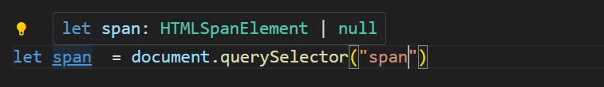

## typeScript 基础类型

基础类型：Boolean、Number、String、`null`、`undefined` 以及 ES6 的 [Symbol](http://es6.ruanyifeng.com/#docs/symbol) 和 ES10 的 [BigInt](https://developer.mozilla.org/zh-CN/docs/Web/JavaScript/Reference/Global_Objects/BigInt)。

+ string类型

```javascript
 
let a: string = '123'
//普通声明
 
//也可以使用es6的字符串模板
let str: string = `dddd${a}
```

+ number类型

```javascript
let notANumber: number = NaN;//Nan
let num: number = 123;//普通数字
let infinityNumber: number = Infinity;//无穷大
let decimal: number = 6;//十进制
let hex: number = 0xf00d;//十六进制
let binary: number = 0b1010;//二进制
let octal: number = 0o744;//八进制s
```

+ boolean 类型

```javascript
let createdBoolean: boolean = new Boolean(1)
//这样会报错 因为事实上 new Boolean() 返回的是一个 Boolean 对象 

let createdBoolean: Boolean = new Boolean(1)    #这样写正确
#定义变量 string 和 String  boolean 和 Boolean 区别很明显
小写的是基元类型， 而大写的是包装对象。 一般也没人用大写定义
```


+ void 空值类型 一般用于定义没有返回值的 函数

```javascript
function voidFn(): void {
    console.log('void')
}
#void也可以定义undefined 和 null类型   非严格模式下
let u: void = undefined
let n: void = null;

#严格模式
let n:void = null 报错
```

注意严格模式下 


+ null 和 undefind 类型

```javascript
let u: undefined = undefined;//定义undefined
let n: null = null;//定义null
n=u   #非严格模式下 null 和undefind 可以交叉赋值。  严格模式下报错
```


### void 和 undefined 和 null 最大的区别

undefind 和null 是所有类型的子类， void 只能赋值给undefind 或者null

```javascript

#这样写会报错 void类型不可以分给其他类型
let v: void = undefined
let num2: string = "1"
num2 = v

//这样是没问题的
let n: null = null
let num2: string = "1"
 
num2 = n
 
//或者这样的
let u: undefined = undefined
let num2: string = "1"
 
num2 = u

```


### 类型等级 向下包含

+ any   和 unknown 顶级类型 

+ Object 

+ Nunber String Boolean  等包装对象

+ number string boolean  基元类型

+ 1  ssfgfd  true  等普通值

+ never 类型

   

   **any 和 unknown的 区别**

```javascript
let an:any=[] 
an=123
an="srdfggf"
an=[12,33,44]

#unknown 和any 的区别
let an:string="234"
let b:unknown =5;
b=an
an = b  #报错  unknown  1.只能给any 和 自身赋值 不能给其他类型赋值


let an:any="234"
let b:unknown =5;

b=an
an = b


2. let unObj:unknown = {oname:"xxxx",function handleClick:()=>{} }
 unObj.oname  # 报错   unknown类型不能访问属性 和方法
```


**Object  object {}  三者的区别**

+ Object 和 { } 都不能添加新属性，也访问不到属性
+ 


## Interface  接口 类型约束

+ 接口定义了几个属性，实现这个接口的对象就必须有相同的属性或者方法。 不能多也不能少。 完全匹配

+ 同名的接口 会进行属性，方法的合并操作

+ 接口继承 extends  ，可以多继承。 相当于合并

   

```javascript
//定义对象约束
interface ObjInterFace{
  userName:string,
  pwd:string
}

interface ObjInterFace{
  sex:number,
  age？:number				 #？可选属性
  readonly like:string,     #只读
  [propName:string]:any    #常用于接口返回，比如我只知道前面5个属性，接口返回的其他属性，我不知道，就可以使用
}						   #索引签名	剩下返回的属性就不需要ts 校验	

let student:ObjInterFace={
  userName:"小马哥",
  pwd:"sfsdfsd",
  sex:2,
  age:7,
  like:"看书",  
  className:"三年一班",
  schoolName:"河东小学"
}
```

```javascript

interface FnInterface{
  (userName:string,pwd:string) : number[]    //接收2个参数，返回数字类型的数组
}

const  doLogin:FnInterface = (userName,pwd): number[] =>{
 return [1,2.4,5]
}
doLogin("ddf","sdfsf")


# 参数 返回值都是基础类型 的函数
//定义参数类型， 返回类型
function add( a:number,b: number):number{
    return a+b;
}
//默认参数
let increment = (a:number = 20 , b:number = 10) :number {
    return a-b;
}


# 参数是对象  返回值是对象

interface UserInforInterface{
  id:number,
  IdCard:string,
}
//参数要符合 接口定义
function getUserInfor(user: UserInforInterface) : UserInforInterface {
  return {
    id:22,
    IdCard:"35540405-x"
  }
}

getUserInfor({id:22,IdCard:"dfgdfg"})


#函数的重载，
let arr:number[] = [11,22,33]
											   #定义函数体	
function arrHandleFn() :number[]               #如果不传递参数，返回所有数据
function arrHandleFn(val:number):number[]      #传递1个，返回1个数据，
function arrHandleFn(val:number[]) :number[]   #传递一个数组则添加数据

function arrHandleFn(val?:number | number[]) :number[]{
  if(typeof val ==="number"){
    return arr.filter(item => item===val)
  }else if(Array.isArray(val)){
    arr.push(...val)
    return arr;
  }else{
    return arr
  }
}
console.log(arrHandleFn([44,55]))
```

## 定义数组

```javascript
let arr:number[]=[1,3,4,5]
let str:string[]=["dd","vv","ccc"]

//泛型方式定义
let list:Array<number> =[11,22,33]

interface ObjIterFace{
  id:number,
  age:number
}
//接口定义 对象数组
let studentList:ObjIterFace[] =[
  {id:1,age:11}
]
//泛型方式定义 对象数组
let stuList2:Array<ObjIterFace> = [
  {id:33, age:33}
]
//定义多维数组  套娃模式
let arr2:number[][] =[[123],[345,44,55],[444,55,66]] 

let arr3:Array< Array <number> > = [[123],[345,44,55],[444,55,66]] 

//大杂烩数组，里面类型多样就用any
let arr4:any[] =[true, 123. :"strg"]
```


### 元组类型

```javascript
#元组类型是数组的一个变种， 长度，类型都是固定的

let arr:[number,string] =[11,"hello"]
arr.push(false)   //报错   TS 推断处arr 是 number | string 的联合类型
let arr1 : readOnly [number,string] =[11,"hello"]   //只读的元组 

#元组的应用场景   解析 exec表格 返回的数据 如title(表头)    的二维数组
let exec : [string,string,number][] = [
    ['小红','三年级一班'，7],
    ['小明','三年级一班'，8],
    ['小东','三年级一班'，8],
    ['吉米','三年级一班'，7]
]
```


## 联合类型

```javascript
#isShow 接收数字或者boolean 类型的参数     #status:number | boolean  联合类型
//拿到后台返回值，0代表false, 1代表true , 加入后台返回的数字
function isShow( status:number | boolean) :boolean{
  return !!status    // !! 强转  !!0 就是false  !!1 还是true , 
}
```

## 交叉类型

```javascript

interface Pople{
    id:number,
    pwd:string  
}

interface Infor{
    idCard:string,
    age:number   
}
# Pople & Infor   交叉类型 有点像接口的 extends
const queryUserInfor =(queryObj : Pople & Infor) : void {
    
}

queryUserInfor({id:11,pwd:"dsf",idCard:"xxxx",age:33})
```

## 类型断言

简单一点就是 我告诉TS 这个变量就是这个类型，你不需要校验了。在编译时候可以忽略警告，运行时候如果传递

的类型不符合，输出结果还是错的

如图  如果传递的str 是number ,就没有length属性


```javascript
#断言写法  （ str as string ）   ( <string> str )
function logLength(str: string | number):void{
  console.log( (str as string).length )
  console.log ( (<string>str).length )
}
logLength(123456)
#编译时候不报错  打印还是undefind   只能说欺骗过了TS类型校验
```


## TypeScript 内置的类型

JS 是由三部分组成的 

+ ECMAScript

   ```javascript
   #ECMAScript 命名规则   
   let num:Number = new Number(1)
   let bool:Boolean = new Boolean(false)
   let date:Date = new Date()
   let err:Error = new Error("出错了")
   ```

   

+ DOM

   ```javascript
   #命名规则   HTMLInputElement HTMLDivElement
   let div:HTMLDivElement  = document.querySelector("div")
   ```

   

+ BOM  鼠标移动上去就能查看到对应类型， 其实就是接口


+ Promise<T>   这个类型接收一个泛型参数， resove返回什么类型，前面就要写什么类型。  后续 .then( res )  res就会有相应类型的方法提示

## class 类

| 类的关键字                            | 描述                                                         |
| ------------------------------------- | ------------------------------------------------------------ |
| public (所有属性，方法默认都是public) | 类自身，类实列，继承这个类的子类以及子类的实例 都可以访问    |
| protected                             | 类本身， 子类能访问 ， 实例不能访问                          |
| private  私有的                       | 只有类本身可以访问， 类的实例都访问不到                      |
| static  定义静态属性和方法            | 静态方法中的this 只能访问静态成员， 不能访问非静态的属性和方法<br />静态属性和方法 通过 类本身直接访问 |
| extends                               | 继承关键字                                                   |
| implements                            | 实现接口关键字，多个接口以 , 分隔                            |
| abstract                              | 定义抽象类                                                   |


```javascript
#定义一个简单的类

class Animal {
  name:string;               #需要注意TS中属性必须在外部定义，然后再构造函数中赋值
  constructor(name:string){
    this.name=name
  }
  eat(foods:string){
    console.log(`${this.name} 爱吃 ${foods}`);
  }
}

let dog = new Animal("小狗");

dog.eat("狗粮")

#extends 继承

class Dog extends Animal{
  constructor(name:string){
    super(name)
  }
}

let dog1 = new Dog("小狗")
dog1.eat("骨头")
```


### 用接口来约束类的属性和行为

```javascript
interface StudentIterFace{
  studentName:string,
  className:string,
  schoolName:string,
  age:number,
  run():void,
}
#类名 implements 接口A,接口B.... {}   多个接口
class Student implements StudentIterFace{
  studentName:string;
  className: string;
  schoolName: string;
  age: number;
  constructor(studentName:string,className:string,schoolName:string,age:number){
    this.studentName=studentName;
    this.className=className;
    this.schoolName=schoolName;
    this.age=age
  }
  run(){
    console.log(`${this.studentName} 在 ${this.className}` );
  }
}
let student = new Student("小明","三年级一班","河北临街小学",7)
student.run();
```


### 抽象类 abstract

人，动物，植物 类似这种具有很多相同共性的可以抽象成一个 大的基类， 学生类，演员都人，都可以实现 人这个抽象类。

特点：

+ 抽象类不能被实例化， 抽象类的构造函数只要是提供给子类调用
+ 抽象类可以有抽象方法，也可以没有。 有抽象方法的一定是抽象类。
+ 抽象方法只有方法体，不能有具体实现
+ 抽象类也可以有 常规的方法 如 下面的例子  Human 中的 eat() , 

```javascript
// 抽象类 人类，  有4个属性，1个抽象方法
abstract class Human{
 name:string
 age:number
 idCard:string
 isSinger?:boolean
 constructor(name:string,age:number,idCard:string,isSinger?:boolean){
  this.name=name
  this.age=age
  this.idCard=idCard
  this.isSinger=isSinger
 }
 //抽象方法 只有方法名称，没有具体实现的方法
 eat():void{
     console.log(`${this.name} 爱吃米饭`)
 }   
 abstract sleep():void
}
# 歌手类继承了 人类 这个抽象类。 就必须包含对应的3-4个属性 ，实现父类中的抽象方法
class  Singer extends Human{
  constructor(name:string,age:number,idCard:string,isSinger:boolean){
    super(name,age,idCard,isSinger)
  }
  sleep(): void {
   console.log(`${this.name} 在睡觉`);
  }
  swim():void{
    console.log(`${this.name} 爱 游泳`);
  }
}

let singer = new Singer("杨超越",22,"366493453563113-x",true)
singer.eat()   //调用抽象类中的方法
singer.sleep()
singer.swim()
//杨超越 在睡觉
//杨超越 爱 游泳

```

## 接口和抽象类的区别

**interface 和 abstract 都能约束 类的属性，行为， 那么他们的区别是什么？**

区别1 设计上的区别

+  接口是从上至下的 （接口就是定制一系列规则，要用我这个接口就必须按接口定义的规则。）

+ 抽象类是至下而上的。 有很多类具有相同的共性， 就可以抽离形成一个抽象的 基类 （模板）

   

区别2

+ 如果接口修改，例如新增了一个属性或者方法， 那么实现这个接口都需要修改

+ 抽象类新增 例如eat() 函数， 子类完全不需要改变， 子类可以直接调用。 如果新增抽象方法就必须改变了。 因为子类要实现抽象类的所有抽象方法。

   
