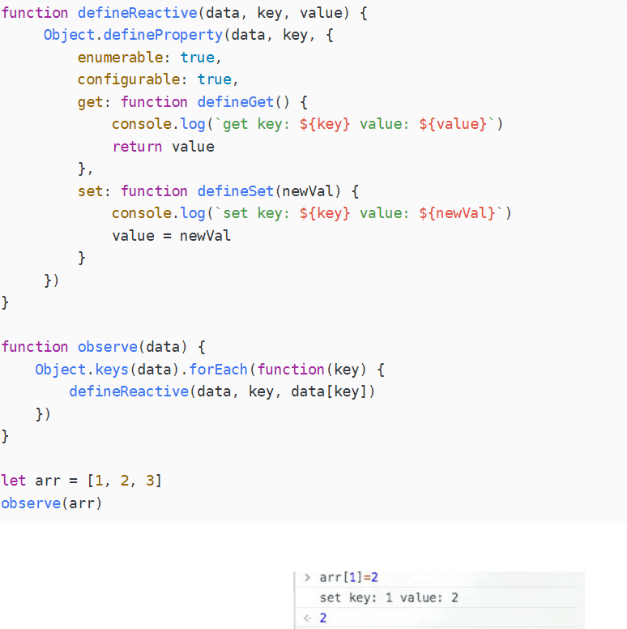

## vue3 和Vue 2的对比

```
1. 首先从整体架构上对比。
   vue3采用monorepo的方式管理， 一个项目下面管理多个项目，每个项目包可以单独发布，引用，便于处理包与包之间的依赖关系。
   缺点就是整体项目的代码量非常大。
   例如： 你可以只引入vue3 的reactivity 模块, 而vue2你使用的时候是把一个完整的vue2代码包全部引入（不仅包含vue2的核心代码模块，还有比如ssr服务端渲染的模块）
```

```
2.Vue3的核心 5大模块
reactivity -> runtimer-dom -> runtime-core   运行时，不处理编译相关的事情
complier-dom -> complier-core     编译模块
```

```
3 vue2是典型的optionsApi 不支持 tree-shaking
 export default({
 	name:"logoing-com",
 	data(){
 		return {}
 	},
 	methods:{
 	
 	},
 	compoted:{
 	
 	}
 })
 
 vue3 使用的是函数式编程， 天生对tree-shaking 的支持就非常友好 compositionAPI
 onMounted(()=>{
 
 })
 setUp(){
 
 }
```

```
4.内部优化
vue2 响应式 使用的是object.defineProperty  对数据进行遍历劫持的方式。 一上来就需要进行递归，所以vue2 data中不建议写
层级较深且复杂的数据格式  深度递归的性能及其低下. 

Vue对数组的7（push、pop、shift、unshift、splice、sort、reverse）进行了自己的实现。

object.defineProperty 如下图 ，其实是能做到对数组下标设置新值做到监听的。 

通过索引改变arr[1]，我们发现触发了set，也就是Object.defineProperty是可以检测到通过索引改变数组的操作的，那Vue2.0为什么没有实现呢？是尤大能力不行？这肯定毋庸置疑。那他为什么不实现呢？

对于对象而言，每一次的数据变更都会对对象的属性进行一次枚举，一般对象本身的属性数量有限，所以对于遍历枚举等方式产生的性能损耗可以忽略不计，但是对于数组而言呢？数组包含的元素量是可能达到成千上万，假设对于每一次数组元素的更新都触发了枚举/遍历，其带来的性能损耗将与获得的用户体验不成正比，故vue无法检测数组的变动。

Object.defineProperty(obj,key,desc)有三个参数:
        obj 为操作的对象,
        key 为对象中的属性名,
        desc 为对应属性的具体配置,是一个对象格式.

	let obj={}
	let num=12
    Object.defineProperty(obj,'age',{
    value:'属性值', //设置属性值 不能与get()set()同时使用
    writable:true, //该属性值是否可编辑 不能与get()set()同时使用
    configurable:true, //该属性是否能删除
    enumerable:true, //该属性是否能枚举
    get(){
      console.log('触发get函数,取值', num)
     return num //读取该属性会触发get,并返回一个val,默认undefined
    },
    set(newVal){
    	console.log('触发set函数,设置新值', newVal)
      num=newVal //设置新值 参数为修改值
    }
})
console.log(obj.age)
obj.age=16;
//控制台输出如下图.可以看到无论是读取还是修改,对象中的属性已经被监听

 触发get函数，取值 12
 12
 触发set函数，设置新值 16
 
 
 
vue3 响应式 使用的是proxy  好处是能支持对象和数组，不用一上来就进行递归，不用改写属性的get,set 。 proxy 采用代理
 	对层级比较深的对象或者数组是在取值的时候在进行代理


```



