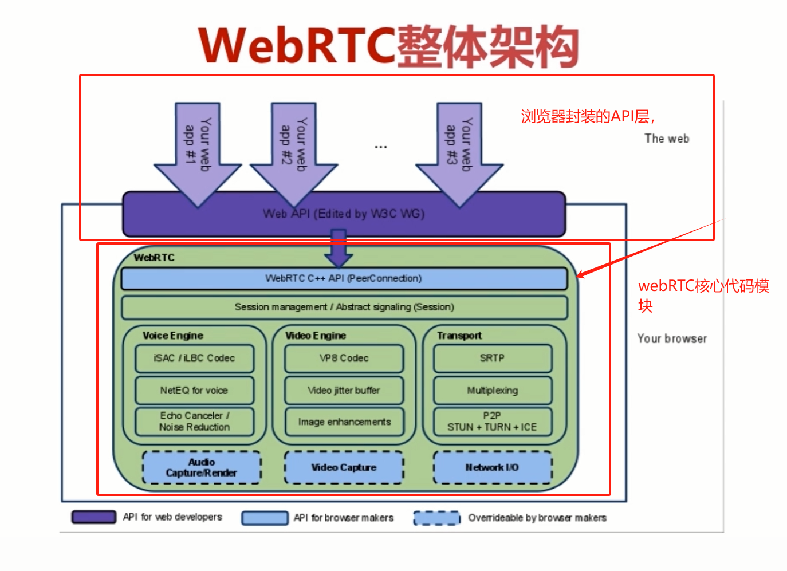
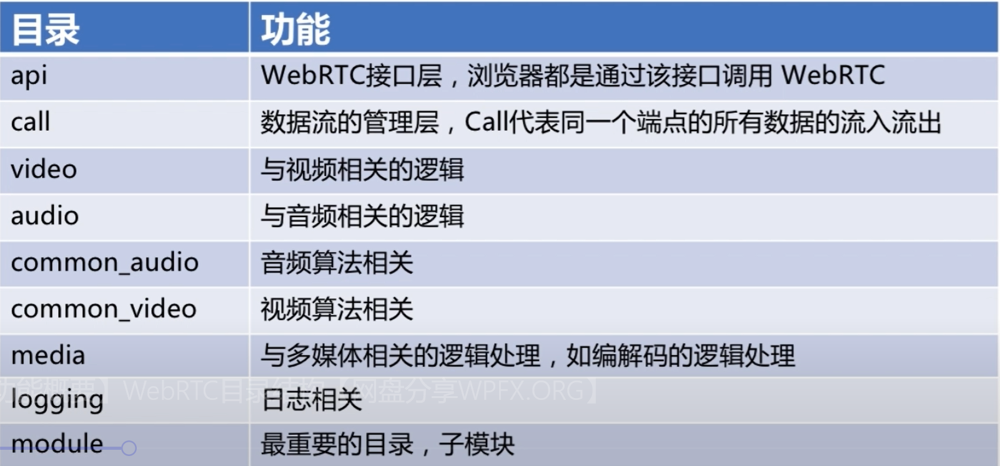
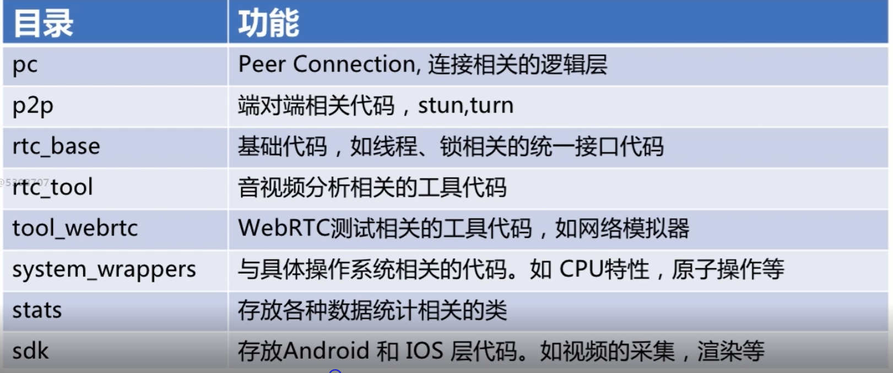
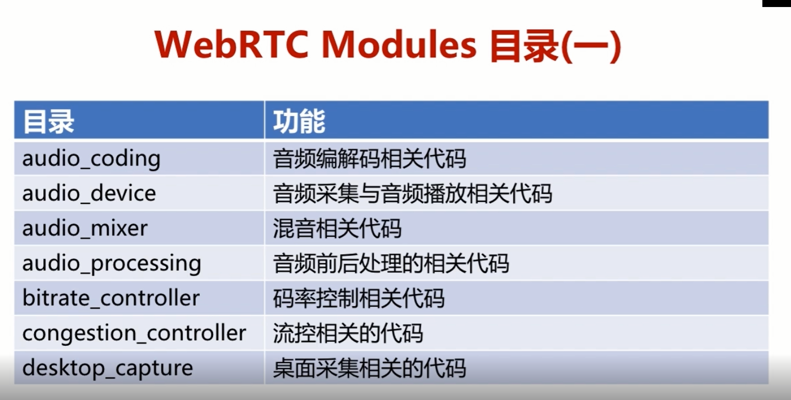
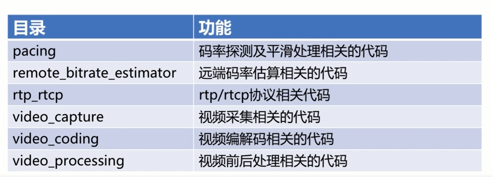
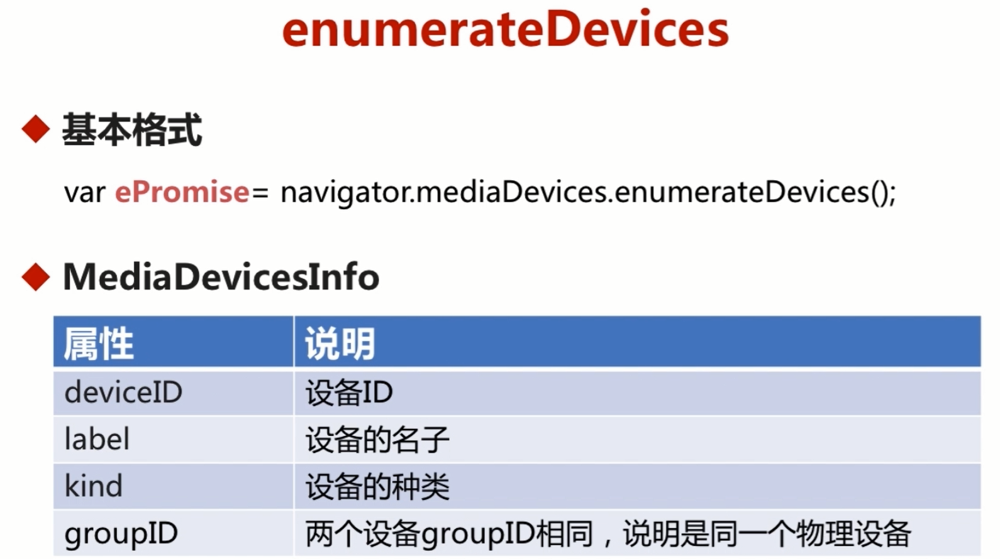

## webRTC 概述

1.音视频处理+即时通讯 的开源库

2.2010年goole 将其开源

3.非常优秀的多媒体框架，跨平台。

##  webRTC 能做什么

音视频实时互动

游戏、即时通讯、文件传输

webRTC是一个百宝箱，传输、音视频处理（回音、降噪等）


## webRTC 架构



​		分成设计。 核心层顶部是 c++的api  peerConnedion  端与端的连接实现

​		第二层是 session 管理

​		第三层 音频处理   视频处理   传输 三个模块

​		第四层是内核相关  一般各个浏览器都有自己的音视频处理内核， 虚线代表可以 替代，

​		 至于 传输IO 一般都用webRTC的 网络I/O

​	

##  webRTC的目录结构






## module 下的子目录





## 获取电脑上音视频设备

```
enumerateDevices

let ePromise =navigator.enumerateDevices.enumerateDevices();

返回的是promise
```


